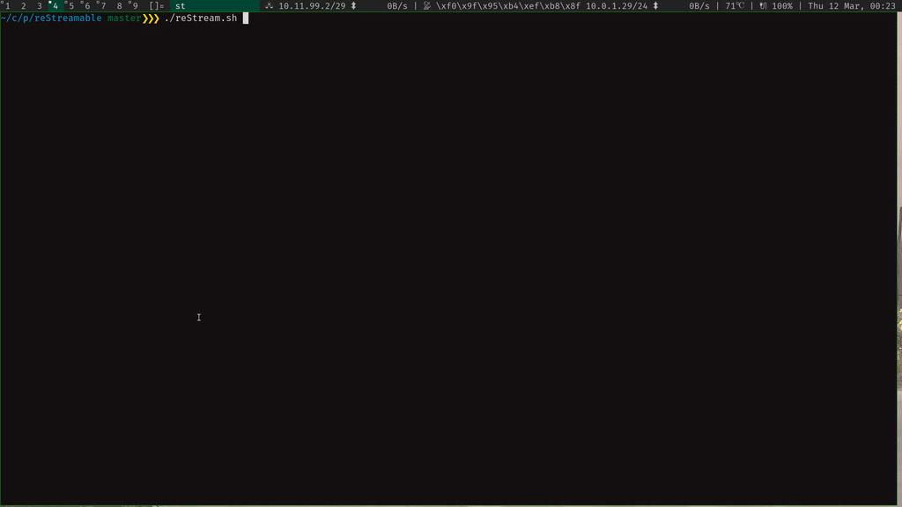

# reStream

reMarkable screen sharing over SSH.

[](https://remarkable.com/store/remarkable)
[](https://remarkable.com/store/remarkable-2)



## Installation

### Requirements

On your **host** machine

- Any POSIX-shell (e.g. bash)
- ffmpeg (with ffplay)
- ssh
- lz4

#### Unix

1. Install `lz4` on your host with your usual package manager.   
On Ubuntu, `apt install liblz4-tool` will do the trick.
2. [Set up an SSH key and add it to the ssh-agent](https://help.github.com/en/github/authenticating-to-github/generating-a-new-ssh-key-and-adding-it-to-the-ssh-agent), then add your key to the reMarkable with `ssh-copy-id root@10.11.99.1`.  
> **Note:** the reMarkable 2 doesn't support `ed25519` keys, those users should generate and `rsa` key. Try out `ssh root@10.11.99.1`, it should **not** prompt for a password.

#### Windows

1. Install [ffmpeg for windows](https://ffmpeg.org/download.html#build-windows).
2. Download [lz4 for windows](https://github.com/lz4/lz4/releases) and extract the `zip` to a folder where you'll remember it (e.g. `C:\Users\{username}\lz4`).
3. Add the `ffmpeg` **and** `lz4` directories to the windows `Path` environment. [Here is a quick guide how.](https://www.architectryan.com/2018/03/17/add-to-the-path-on-windows-10/)
    - Control Panel > Edit the system environment variables > Environment Variables
    - Find the `Path` variable under System variables, click edit.
    - Add two _New_ entries: one to the **bin** directory in the `ffmpeg` directory, and one to the `lz4` directory you created.
    - Click OK
4. (Re)start `bash` so the new `Path` is used.
5. Generate a new ssh-key using `ssh-keygen`.
6. Send the public key to the reMarkable (connect trough USB cable) using `ssh-copy-id -i ~/.ssh/id_rsa root@10.11.99.1`
7. Try out `ssh root@10.11.99.1`, it should **not** prompt for a password.

### reStream installation

The instructions below will install the files from the [latest release](https://github.com/rien/reStream/releases/).
In particular, `reStream.sh` is the executable on the host, and `restream.arm.static` is the binary which has to be moved to the reMarkable with the name `restream`.

#### Host

Download [reStream.sh](https://github.com/rien/reStream/releases/latest/download/reStream.sh) and make it executable

```
$ chmod +x reStream.sh
```
##### Tip

> If you save `reStream.sh` in a `PATH` directory as `reStream`, you can launch it as `reStream`.  
> On Ubuntu, list these folders with `echo $PATH`. One should be`/usr/local/bin`.  
> As root, download the executable there: 
```
# wget https://github.com/rien/reStream/releases/latest/download/reStream.sh -O /usr/local/bin/reStream
# chmod +x /usr/local/bin/reStream
```

#### reMarkable

You can install `restream` on reMarkable in three ways.

- Install via [toltec](https://github.com/toltec-dev/toltec) if you use it.

```
$ ssh root@10.11.99.1 'opkg install restream'
```

- If you have access to internet on your reMarkable, download directly the binary onto it:

```
$ ssh root@10.11.99.1 'wget https://github.com/rien/reStream/releases/latest/download/restream.arm.static -O /home/root/restream && chmod +x /home/root/restream'
```

- Download the [restream](https://github.com/rien/reStream/releases/latest/download/restream.arm.static) binary onto your host, move it to reMarkable and make it executable.

```
$ scp restream.arm.static root@10.11.99.1:/home/root/restream
$ ssh root@10.11.99.1 'chmod +x /home/root/restream'
```

## Usage

1. Connect your reMarkable with the USB cable.
2. Make sure you can [open an SSH connection](https://remarkablewiki.com/tech/ssh).
3. Run `./reStream.sh` in the script directory or `reStream` [if you've installed it in your PATH](#tip) 
4. A screen will pop-up on your local machine, with a live view of your reMarkable!

### Options

- `-h --help`: show usage information
- `-p --portrait`: shows the reMarkable screen in portrait mode (default: landscape mode, 90 degrees rotated tot the right)
- `-s --source`: the ssh destination of the reMarkable (default: `root@10.11.99.1`)
- `-o --output`: path of the output where the video should be recorded, as understood by `ffmpeg`; if this is `-`, the video is displayed in a new window and not recorded anywhere (default: `-`)
- `-f --format`: when recording to an output, this option is used to force the encoding format; if this is `-`, `ffmpeg`’s auto format detection based on the file extension is used (default: `-`).
- `-w --webcam`: record to a video4linux2 web cam device. By default the first found web cam is taken, this can be overwritten with `-o`. The video is scaled to 1280x720 to ensure compatibility with MS Teams, Skype for business and other programs which need this specific format. See [Video4Linux Loopback](#video4linux-loopback) for installation instructions.
- `--mirror`: mirror the web cam video (`--webcam` has to be set). By default or as only choice, some programs, such as Zoom and Discord, mirror the camera. This flag restores the correct orientation.
- `-m --measure`: use `pv` to measure how much data throughput you have (good to experiment with parameters to speed up the pipeline)
- `-t --title`: set a custom window title for the video stream. The default title is "reStream". This option is disabled when using `-o --output`
- `-u --unsecure-connection`: send framebuffer data over an unencrypted TCP-connection, resulting in more fps and less load on the reMarkable. See [Netcat](#netcat) for installation instructions.

If you have problems, don't hesitate to [open an issue](https://github.com/rien/reStream/issues/new) or [send me an email](mailto:rien.maertens@posteo.be).

## Extra Dependencies

On your **host** machine:

- Video4Linux Loopback kernel module if you want to use `--webcam`
- netcat if you want to use `--unsecure-connection`

### Video4Linux Loopback

To set your remarkable as a webcam we need to be able to fake one. This is where the Video4Linux Loopback kernel module comes into play. We need both the dkms and util packages. On Ubuntu you need to install:

```
# apt install v4l2loopback-utils v4l2loopback-dkms
```

In some package managers `v4l2loopback-utils` is found in `v4l-utils`.

After installing the module you must enable it with

```
# modprobe v4l2loopback
```

To verify that this worked, execute:

```
$ v4l2-ctl --list-devices
```

The result should contain a line with "platform:v4l2loopback".

### Netcat

To use an unsafe and faster connection, we need the command `nc`, abbreviation of `netcat`.  
If your system does not provide `nc`, the output of `command -v nc` is empty. In this case you need to install it.  
[Several implementations](https://wiki.archlinux.org/index.php/Network_tools#Netcat) of `netcat` exists. On Ubuntu, you can install the version developed by OpenBSD, which is light and supports IPv6:

```
# apt install netcat-openbsd
```

## Troubleshooting

Steps you can try if the script isn't working:

- [Set up an SSH key](#installation)
- Update `ffmpeg` to version 4.
- Make sure RSA keys are allowed on your system:
    - In some modern Unix distributions, RSA keys are considered ["legacy"](https://fedoraproject.org/wiki/Changes/StrongCryptoSettings2) and will no longer work out of the box.
    - Therefore you need to add a section to your `~.ssh/config` file to allow use of RSA ssh keys for specified hosts. (according to [https://remarkablewiki.com/tech/ssh](https://remarkablewiki.com/tech/ssh), Remarkable devices might not work with non-RSA keys, which is the reason for why this is necessary.)
    - This example should work without any additional configuration, although `PubkeyAcceptedKeyTypes=ssh-rsa` is required if you want to modify it: 
        ```
        Host remarkable
            HostName 10.11.99.1
            User root
            PubkeyAcceptedKeyTypes=ssh-rsa
        ```
    - You can then use the -s flag to connect to the Remarkable: `./reStream.sh -s remarkable`

## Development

If you want to play with the `restream` code, you will have to [install Rust](https://www.rust-lang.org/learn/get-started).

There are two ways of building the required restream binary for streaming the reMarkable framebuffer. For both approaches, the generated restream binary will be located under `target/armv7-unknown-linux-gnueabihf/release/restream`.

- Using docker and the toltec toolchain

You can use the [toltec toolchain docker images](https://github.com/toltec-dev/toolchain) to build a restream binary compatible with the reMarkable.

```
docker run --rm -v $(pwd):/project -v /project/.cargo -w "/project" ghcr.io/toltec-dev/rust:latest cargo build --release --target=armv7-unknown-linux-gnueabihf
```

- Using the reMarkable toolchain 

[Setup the reMarkable toolchain](https://github.com/canselcik/libremarkable#setting-up-the-toolchain) to do cross-platform development.
